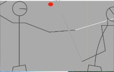

After starting fencing classes in the summer of 2004, it wasn't long before I desired a video game expression of the same.  But though there are scores of fighting games, none had that light, fast, to-and-fro flavor indicative of fencing.  So, I fired up the compiler and spent the next year designing and prototyping a game that would accurately capture that feel.  What I thought was going to be a simple and straight-forward fighting game blossomed into one of the most deliberate and practicality-driven game designs I had ever done. 

The game began humbly, with 2D stick figures controlled by arrow keys and a few attack buttons of varying height and commitment.  Instead of a pugilist's speed versus power tradeoff I chose a reach versus recovery tradeoff:  a deep lunge will quickly invade your opponent's personal space, but if you miss or are parried, you are a sitting duck.  But like the original Prince of Persia, the simple control scheme didn't allow for parries with any reliability.  The game quickly devolved into a pixel-perfect placement exercise with "machine-gun" stabbing.  

Interestingly, foil fencing has the same problem.  It solves it with a rule called right-of-way:  once an opponent has parried your attack, his riposte will have priority over yours even if you strike him first.  As a game feature it encouraged parrying, but it still didn't cure the unreliability problem.  A player would regularly want to parry but successfully doing so was more guesswork than anything.  Instead of machine-gun stabs, the game comprised baiting the lunge.  

This was when the design began in earnest.  I reexamined the subject matter for clues on how to fix it, but since the unreliability problem didn't exist there, I brought the tropes of the fighting genre into question.  I realized one thing quickly:  no other martial art shares the many issues peculiar to foil fencing.  

For one, all attacks are three foot long stabs, no more and no less.  Usually, swords increase one's attack range with no loss to existing options:  an armed man in close can still cut your wrist or draw-press the edge into your torso.  But a sword without an edge has very few close techniques, so a missed thrust usually means backing up or cocking back the arm until the tip is again between the fencers.  What results is a far-away tickling game with the occasional bum rush, the latter of which necessitates precision with an awkward down-thrust.  The game reflected this only so far as reacting to a missed lunge, the most obvious and committed maneuver it had.

The solution was something I would never have added spontaneously, because in any other 2D fighting game it comes across as gratuitous, sprite-blurring cinematics:  the ability of the camera to zoom.  With this unplanned feature, no longer was the lunge the only visible attack.  When the fencers were too close for lunges, the camera would zoom in so that even quick half-thrusts were plainly visible.  Now the fencers had the long distances they required for the more mobile maneuvers, but the details when in close would still remain visible.  The feel of the game improved remarkably, felt as if it finally had some breathing room.  But with this increased ability to breathe came freshly apparent peculiarities. 

Fencing has no provision for brute force, either offensively or defensively.  The swords, called foils, are a whip-like cord of metal so flexible they can be tied in a granny knot.  They are too insubstantial to push or deflect anything except paper airplanes and other foils, and the latter only by using the forte, the thicker, back half of the blade.  With such a limited ability to redirect attacks, fencing becomes a millimeter-precise geometric dance.  Touching your opponent's thrust on its foible -- the weaker half of the blade -- changes his attack angle by a mere degree, but that is enough to send his tip sideways by a critical inch.  Trying to force through your block only causes his foil to bend, sending his tip even further astray.   Speed is at best secondary:  I could not touch my seventy year old fencing instructor with any attack I cared to throw at him, because his every move was pathologically economical.  He didn't parry or attack so much as shift in place.  

By contrast, with unarmed martial arts there is little difference between, say, two consecutive left hooks that don't travel through exactly the same space.  The angle of impact, the part of the body struck, and where in the hook's power range the impact event occurs, are the overwhelming factors.  The result is that martial artists learn distinct, discrete attacks:  jab, hook, uppercut.  And though blending the basic attacks into, for example, a 30º angled "upper-hook" is possible, it isn't consciously done in practice for a couple of reasons.  One, due to the way the human nervous and muscular system works, the oft-practiced technique is both stronger and faster.  And two, misalignment of the offensive limb will cause as much if not more damage to the attacker than to the defender.   These discourage variation.

Design-wise, a small set of discrete attacks works well on a small set of discrete buttons, and this is the direction fighting games take.  But when precision is required, analog controls are the obvious answer.  Analog would have been vehemently opposed by myself at the start of this project.  If a zooming camera in a 2D fighter is gratuitous, analog controls are utter blasphemy.  But after the camera showed me the sword work in such detail, I had to acknowledge what I was seeing.  Believable fencing was a problem of input precision.  Unfortunately, two problems came with that, and one of them looked to be a design-killer. 

Of the two problems that precision input brought, one of them required slower gameplay.

Slowing the gameplay was worse than blasphemous.  It went against the original goal of a fast, light, to-and-fro fencing sim.  I wrestled with this for a long while, but finally decided it was a question of either having cake or eating it.  The to-and-fro aspect comes from the ability to intercept and return attacks, and for that to happen, a human player must have the time to see and react to that attack.  Ignoring the reality of precision fencing maneuvers for the sake of twitch gameplay creates something other than fencing, which annuls the whole point much more completely than a relaxation of gameplay speed ever could.  Besides, as long as the player is fully engaged with placement, lunging, dodging, parrying, beating, and riposting, then the gameplay feels fast.  And the feeling, not the reality, is the design goal.
 

Less troubling but more work was the practical input problem.  How should analog work in a fighting game?  I purchased a dual-analog game controller, a clone of the Playstation controller, and started experimenting.  Assigning the sword's tip to one stick was trivial, and foot movement to the other stick, obvious.  Since attacking now consisted of pushing towards on one or both sticks, I now had a fighting game utterly controlled by two analog sticks and no buttons whatsoever.  But this meant the old parrying method of pressing the same attack button as the opponent had would no longer work.  I returned to consulting the source material. 

Fencing has the notions of a sword being "in line" and "out of line".  A sword is in line if it is aiming at the opponent's target area, and will typically stay that way until the opponent forces it out of line.  Parrying is accomplished in many ways, but the commonest is the beat.  A sideways wrist flick hits your opponent's sword, momentarily knocking it out of line and giving you right-of-way.  Not only must he bring it back in line to be able to strike you, but he must cope with your right-of-way.   
 
The beat button debuted, and with it a measure of how far out of line a sword was at any given moment.  Tap the beat button when the swords were crossed to misalign your opponent's sword.  (If the swords are not crossed when you beat, only your own sword is out of line.)  The penalty time was originally constant, but playtesting found that the flow fell into lock-step.  While that was certainly the to-and-fro aimed for, winning a duel was attritional:  with every exchange you tried to perfectly place and time your beat to get a few frames closer to your opponent before his own sword came back in line.  This was not fun.  The penalty time was then calculated based on where the blades crossed.  This produced "sweet spots" to beat or beat with, and the closer to the sweet spot you got, the bigger time window you were rewarded with.  Not only was this a visible, mostly-controllable gameplay mechanic -- the out of line sword was shaded darker in proportion to the timer -- but this also created a bonus for a skilled player:  against more predictable opponents, he would be able to hit the sweet spots regularly, gaining an enormous advantage.  Now the duels were dynamic, believable, and rewarded skill.  Now they were fun.

I finally had a solid and enjoyable, if very basic, game.  It looked and controlled nothing like I originally imagined, but afterward I had trouble imagining it in any other way.  The core gameplay, the hardest part, was done.  From here on out, the rest of the design would be accretive.

Momentum and inertia were added to body movement.  Besides lending additional realism, pre-accelerating for a sliding lunge or fléche ("arrow", an unabashed sprint) became a new tactic.  Also added was an instinctive lean-away animation when the sword tip came very near the face, which temporarily reduced the opponent's forward attack range (since the shoulder goes with it) and could even cause back-peddling.  It was another hook on which to hang tactics, plus further squirming animations would be a later hook for characterization.
 

Two more buttons were added as well.  The disengage button flicks your blade to the other side of your opponent's with a quick circular wrist motion.  A properly-timed disengagement will dodge ("deceive") your opponent's beat, keeping your blade in line and even allowing a counter-beat.  This feature discouraged hammering on the beat button as soon as the swords crossed.  Since deceptions require anticipating the opponent, I artificially lengthen the out-of-line time penalty for a deceived beat over a missed beat.

The other button, invert, flipped your sword point-down and kept it that way for as long as you held it.  If you found your hand and hilt near your head when the opponent deceived to a low line, you would never get the forte down there fast enough.  Pressing invert parried the low surprise with a swish and snap of the foible.  Interestingly, it also put your character into a quasi-mode that eased sweeping parries and in-close down-thrusts, while attacking high or at a distance would be impossible.  

At the end of a year's work, the unresolved issues of the design increasingly called for testing with actual content.  Animating an out of line sword is difficult from a side view, and it has time information that must be quickly and accurately conveyed to the players.  While the stick figures can be drawn in shades of gray, shading or fading actual graphics may not work as well.  Secondly, a thrust is completely silent, and a half-completed thrust especially so.  Voice, breathing, and footwork may not adequately fill that silence.  Finally, there are many other maneuvers of fencing that could still be added, perhaps even by a combination of existing buttons, such as a prise de fer ("taking the blade"), an envelopment, or a glisé ("glide").  But evoking subtleties like these rely on what the content can muster.
 

Fencing is an old aristocratic art, filled with refreshingly euphemistic terms for many situations:  baiting an attack is called an "invitation", forcing an attack through his guard is "to insist", and the point-scoring strike is a "touch" -- touché.   Such a rich vocabulary is a designer's playground, because he can immediately analyze the interplay of the principal tokens for possible inclusion and expression within a design.  Though the game lost some of its pick-up-and-play ability due to the new control scheme, people new to fighting games, or all videogames, have lost nothing.  The re-designed gameplay mechanics are visible and readily understandable to everyone.  And that is the final coup de grâce -- "graceful stroke". 
